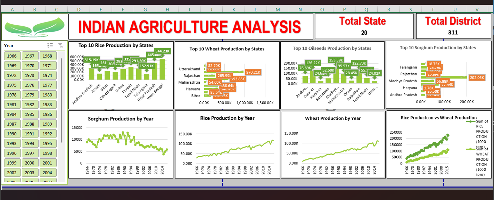

# 🌾 Agriculture Data Analysis (Excel Project)

## 📊 Project Overview
This project focuses on analyzing agricultural production trends across India using Microsoft Excel. The objective was to uncover insights related to crop performance, regional variations, and yearly production patterns.

---

## 🛠 Tools & Technologies
- Microsoft Excel  
- Pivot Tables  
- Data Cleaning  
- Charts & Data Visualization  

---

## 📁 Dataset
- Agricultural production data (state-wise, crop-wise, year-wise)

---

## 📊 Key Insights
- Identified top 5 states contributing highest agricultural production
- Observed consistent growth trends in major crops over multiple years
- Highlighted regional variations in crop performance
- Enabled easy comparison using interactive filters 

---

## 📊 Dashboard Features
- Interactive filters (state & year selection)  
- Dynamic charts and visualizations  
- Clean and user-friendly layout  

---

## 📸 Dashboard Preview

---

## 🚀 Outcome
This project demonstrates the use of Excel for data analysis and visualization, helping derive meaningful insights for decision-making in the agriculture sector.

---

## 🔗 Project Link
[View Project on GitHub](https://github.com/gauravraj0724/Agriculture-Data-Analysis-Excel)
